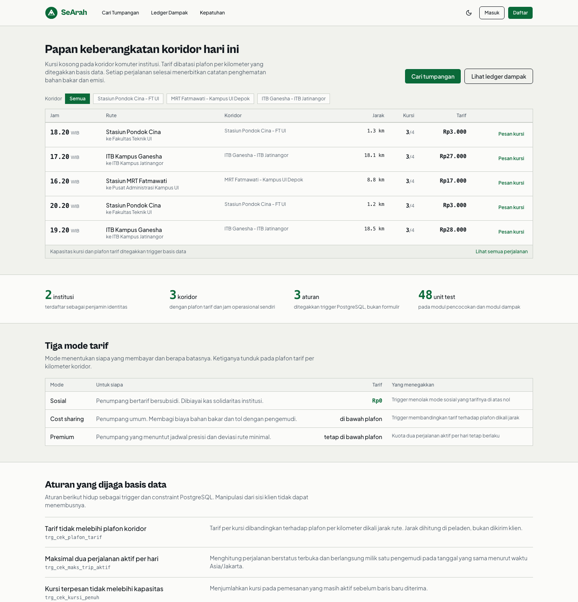
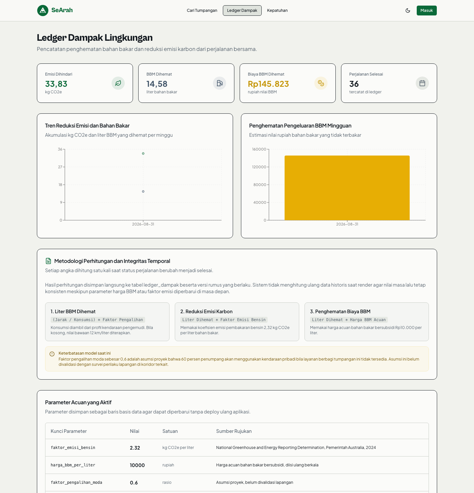
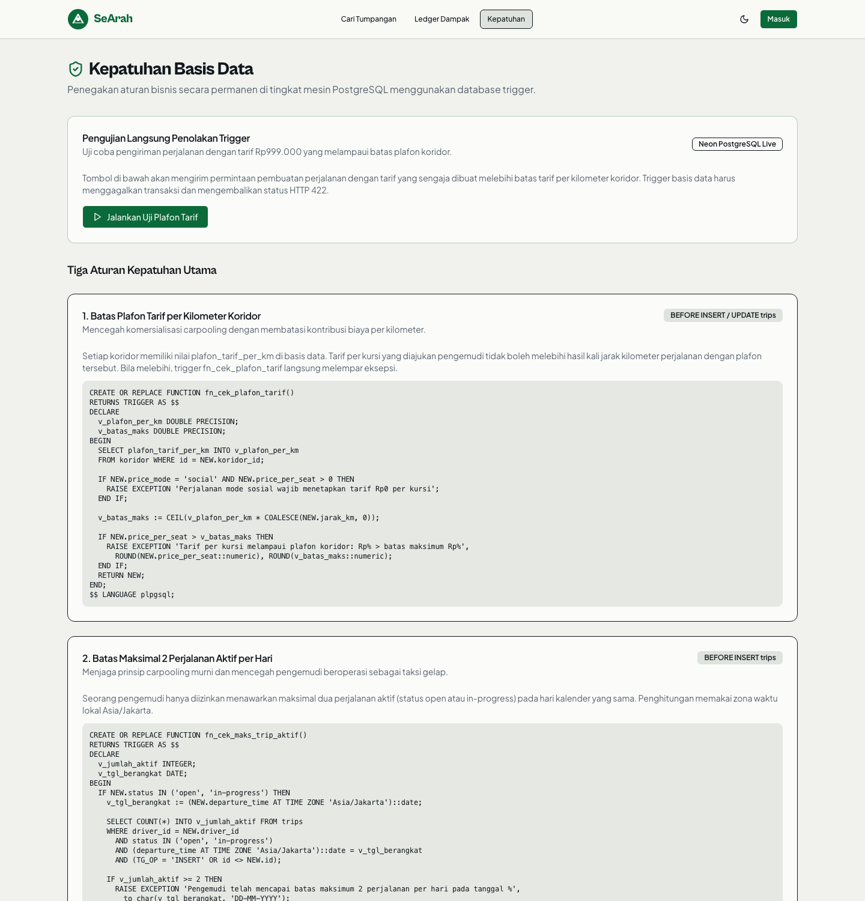
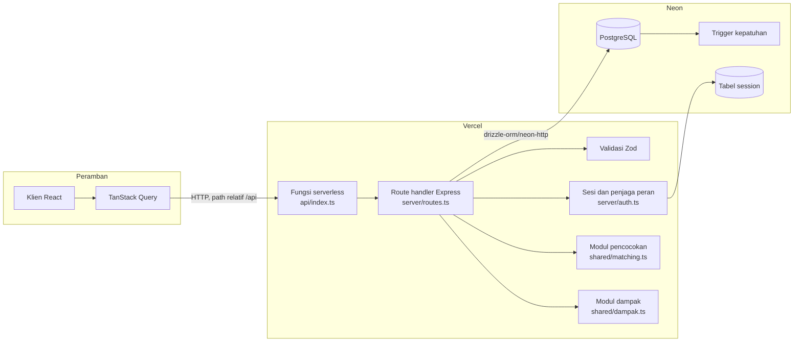

# Searah

Platform berbagi kursi kosong untuk koridor komuter tertutup milik institusi, yang menghitung dan menerbitkan dampak setiap perjalanan.

Demo: `[URL deploy diisi setelah penerapan]`
Repositori: `https://github.com/GhazyUrbayani/searah-itechno`

## 1. Penjelasan Aplikasi

### Latar belakang

Masyarakat Transportasi Indonesia memperkirakan pemborosan bahan bakar akibat kemacetan Jabodetabek mencapai 2,2 juta liter setiap hari. Dinas Perhubungan Provinsi Jakarta menghitung kerugian ekonomi kemacetan Jakarta sekitar Rp100 triliun per tahun, ditambah perkiraan dampak kesehatan Rp44 triliun. Kementerian Perhubungan mencatat angka nasional sekitar Rp77 triliun per tahun dengan populasi kendaraan bermotor 172,94 juta unit.

Berbagi kursi adalah jawaban yang sudah lama dikenal. Pemain lama sudah ada sejak 2005. Namun tiga celah belum tertutup.

Celah pertama adalah rasa aman. Menumpang kepada orang asing di pasar terbuka menuntut kepercayaan yang tidak dimiliki siapa pun. Verifikasi individual membantu, tetapi tidak ada pihak yang menanggung akibat bila terjadi sesuatu.

Celah kedua adalah bukti. Hampir semua layanan mengklaim mengurangi emisi. Hampir tidak ada yang menunjukkan rumusnya. Angka penghematan muncul sebagai hasil akhir tanpa parameter, tanpa sumber, dan tanpa cara memeriksanya.

Celah ketiga adalah batas hukum. Larangan beroperasi sebagai angkutan komersial biasanya hanya ditulis di syarat dan ketentuan. Aturan yang hidup di dokumen tidak menghentikan transaksi apa pun.

### Tujuan

Searah menutup ketiga celah itu di lingkup koridor milik satu institusi. Institusi menjadi penjamin identitas, sehingga penumpang tidak berhadapan dengan orang asing. Rumus dampak dibuka lengkap dengan parameter dan sumbernya, sehingga klaimnya dapat diperiksa. Batas tarif, kuota harian, dan kapasitas kursi ditegakkan trigger PostgreSQL, sehingga aturan berlaku di lapisan penyimpanan dan tidak dapat ditembus dari sisi klien.

### Pemetaan Tujuan Pembangunan Berkelanjutan

| SDG | Klaim | Bukti di dalam produk |
|---|---|---|
| 7. Energi bersih dan terjangkau | Mengurangi konsumsi bahan bakar per orang per perjalanan | Tabel `ledger_dampak` menyimpan liter yang dihemat per pemesanan selesai, beserta versi rumus |
| 8. Pekerjaan layak dan pertumbuhan ekonomi | Menekan biaya transportasi harian komuter | Plafon tarif per kilometer ditegakkan trigger `trg_cek_plafon_tarif`, dan platform tidak mengambil margin |
| 9. Industri, inovasi, dan infrastruktur | Menaikkan tingkat isian kendaraan yang sudah ada | Modul pencocokan `shared/matching.ts` memberi peringkat kandidat dengan lima komponen berbobot |
| 11. Kota dan permukiman berkelanjutan | Mengurangi jumlah kendaraan pada koridor komuter tetap | Koridor tertutup dengan jam operasional dan batas deviasi, tersimpan di tabel `koridor` |

Angka pada tabel di atas berasal dari data contoh, bukan dari operasi lapangan. Bagian 13 menjelaskan batasnya.

## 2. Fitur Utama

### 2.1 Koridor tertutup berbasis institusi

Perjalanan tidak berdiri sendiri. Setiap perjalanan wajib terikat pada satu koridor milik institusi, lewat kolom `trips.koridor_id` yang berkunci asing. Koridor menyimpan titik asal, titik tujuan, radius jemput, batas deviasi, plafon tarif per kilometer, dan jam operasional. Pencocokan hanya berjalan antar anggota koridor yang sama.

Halaman depan menampilkan papan keberangkatan koridor hari ini, bukan kalimat pemasaran. Baris berisi jam, asal, tujuan, jarak, sisa kursi, dan tarif.



### 2.2 Ledger Dampak

Setiap pemesanan yang berstatus selesai menghasilkan satu baris di `ledger_dampak`. Baris itu menyimpan liter yang dihemat, kilogram CO2e yang dihindari, rupiah yang dihemat, dan versi rumus yang dipakai saat itu.

Halaman `/dampak` menampilkan agregat dan grafik mingguan. Panel metodologi membuka rumus, nilai tiap parameter, dan sumbernya. Panel yang sama memuat peringatan bahwa faktor pengalihan moda 0,6 masih asumsi.



### 2.3 Kepatuhan yang ditegakkan basis data

Tiga aturan hidup sebagai trigger PostgreSQL, bukan sebagai validasi formulir. Halaman `/kepatuhan` menampilkan ketiganya beserta potongan SQL yang menegakkannya, dan menyediakan tombol yang sengaja mencoba melanggar aturan lalu menampilkan penolakan yang datang dari basis data.



### 2.4 Rincian skor pencocokan

Hasil pencocokan tidak berhenti pada urutan. Setiap kartu hasil punya tombol yang membuka rincian skor sebagai bar per komponen, lengkap dengan nilai, bobot, dan kontribusinya terhadap skor akhir. Panel yang sama menampilkan ukuran mentah seperti jarak titik jemput ke rute dalam meter dan selisih waktu dalam menit.

Panel ini berada di halaman `/trips` dan hanya terlihat setelah masuk, sehingga tidak ikut tertangkap pada tangkapan layar publik di atas. Contoh keluarannya ada di Bagian 7.

## 3. Teknologi yang Digunakan

| Teknologi | Peruntukan | Alasan pemilihan |
|---|---|---|
| React 18 dan TypeScript | Antarmuka pengguna dan tipe bersama antara klien dan server | Tipe skema Drizzle dipakai ulang di klien, sehingga perubahan kolom langsung memunculkan galat kompilasi di sisi yang salah |
| Vite 7 | Peladen pengembangan dan pembundel produksi | Waktu muat ulang cepat, dan keluarannya berupa berkas statis yang dilayani Vercel tanpa peladen tambahan |
| Wouter | Perutean di sisi klien | Ukurannya kecil dan cukup untuk sembilan rute. React Router membawa lebih banyak dari yang dibutuhkan proyek ini |
| TanStack Query | Pengambilan data, cache, dan pembaruan berkala | Pembaruan berkala menggantikan koneksi persisten yang tidak dapat berjalan di lingkungan serverless. Selang 3 detik dipasang hanya pada tampilan yang menunjukkan sisa kursi |
| Radix UI dan shadcn | Komponen antarmuka dasar | Perilaku aksesibilitas seperti fokus dan peran ARIA sudah tertangani, sehingga usaha terpakai untuk tata letak |
| Tailwind CSS | Penataan gaya | Gaya menempel pada markah, sehingga pemeriksaan kerapian pada lebar 360 piksel dilakukan di satu tempat |
| Recharts | Grafik mingguan pada halaman dampak | Sudah berbasis React dan cukup untuk dua grafik. Pustaka grafik yang lebih besar tidak diperlukan |
| Express 5 | Route handler API | Express 5 meneruskan promise yang ditolak ke penangan galat, sehingga handler async tidak perlu dibungkus try dan catch satu per satu |
| Neon Postgres | Basis data terkelola | Filesystem pada hosting serverless bersifat sementara per instance, sehingga basis data terkelola adalah satu-satunya cara data bertahan. Endpoint pooled menjaga jumlah koneksi tetap terkendali |
| Drizzle ORM dan drizzle-kit | Definisi skema, kueri, dan sinkronisasi skema | Skema ditulis sebagai TypeScript, sehingga tipe baris dihasilkan langsung dari definisi kolom |
| `@neondatabase/serverless` | Driver HTTP ke Neon | Setiap kueri adalah satu permintaan HTTP tanpa koneksi persisten, yang cocok untuk fungsi berumur pendek |
| Zod dan drizzle-zod | Validasi masukan di setiap route handler | Skema validasi diturunkan dari skema tabel, sehingga aturan kolom tidak ditulis dua kali |
| express-session dan connect-pg-simple | Sesi login | Sesi di memori hilang setiap cold start dan membuat pengguna ter-logout acak. Tabel `session` berada di Postgres yang sama |
| bcryptjs | Hash kata sandi | Murni JavaScript, tidak membawa modul native yang sering gagal saat pembundelan untuk fungsi serverless |
| Helmet dan express-rate-limit | Header keamanan dan pembatas laju | Content Security Policy, `X-Frame-Options`, dan `Referrer-Policy` dipasang di satu tempat |
| Vitest | Pengujian modul pencocokan dan modul dampak | Memakai konfigurasi dan alias jalur yang sama dengan Vite, sehingga tidak ada penyiapan transpilasi terpisah |

## 4. Cara Instalasi

### Prasyarat

Node.js 20 atau lebih baru, npm, dan satu akun Neon.

### Langkah

1. Klon repositori dan masuk ke direktorinya.

```bash
git clone https://github.com/GhazyUrbayani/searah-itechno.git && cd searah-itechno
```

2. Pasang dependensi.

```bash
npm install
```

3. Buat project Neon di `https://console.neon.tech`, lalu buka menu Connection Details dan salin connection string yang berlabel pooled.

4. Salin `.env.example` menjadi `.env`, lalu isi `DATABASE_URL` dengan connection string tadi.

```bash
cp .env.example .env
```

5. Buat kunci penandatangan sesi, lalu isikan ke `SESSION_SECRET` di `.env`.

```bash
openssl rand -base64 32
```

6. Buat tabel di Neon.

```bash
npm run db:push
```

7. Isi data contoh dan tiga akun demo.

```bash
npm run demo:reset
```

8. Jalankan aplikasi, lalu buka `http://localhost:5050`.

```bash
npm run dev
```

Port bawaan adalah 5050. Port 5000 dihindari karena pada macOS port itu dipakai AirPlay Receiver dan menjawab setiap permintaan dengan HTTP 403.

## 5. Cara Penggunaan

### Perintah npm

| Perintah | Kegunaan |
|---|---|
| `npm run dev` | Menjalankan peladen pengembangan beserta Vite pada port 5050 |
| `npm run check` | Memeriksa tipe TypeScript tanpa menghasilkan keluaran |
| `npm run build` | Memeriksa tipe, lalu membangun klien dan peladen untuk produksi |
| `npm start` | Menjalankan hasil build produksi |
| `npm test` | Menjalankan 48 unit test |
| `npm run test:coverage` | Menjalankan test beserta laporan cakupan |
| `npm run db:push` | Menyinkronkan skema Drizzle ke Neon |
| `npm run demo:reset` | Mengosongkan lalu mengisi ulang seluruh data demo |

### Akun demo

Ketiga akun dibuat ulang setiap kali `npm run demo:reset` dijalankan.

| Peran | Email | Kata sandi |
|---|---|---|
| Pengemudi | `driver@searah.id` | `searah123` |
| Penumpang | `passenger@searah.id` | `searah123` |
| Admin koridor | `admin@searah.id` | `searah123` |

### Alur singkat untuk mencoba

Masuk sebagai penumpang, buka Cari Tumpangan, pilih koridor, lalu tekan Cocokkan perjalanan. Buka Lihat rincian skor pada hasil teratas untuk melihat asal-usul angkanya. Setelah itu masuk sebagai pengemudi, buka Buat Perjalanan, dan tekan tombol Uji tarif di atas plafon untuk melihat penolakan yang datang dari basis data. Terakhir buka halaman Ledger Dampak untuk melihat agregat dan panel metodologi.

## 6. Arsitektur



Klien tidak menyimpan status login di memori. Setiap kali halaman dimuat, `GET /api/auth/me` membaca cookie httpOnly dan mengembalikan pengguna, sehingga login bertahan setelah refresh. Data perjalanan mengalir lewat TanStack Query, yang menarik ulang tampilan sisa kursi setiap 3 detik. Skoring pencocokan berjalan sebagai fungsi murni di lapisan aplikasi, sedangkan aturan kepatuhan berjalan sebagai trigger di lapisan penyimpanan.

## 7. Cara Kerja Pencocokan

Jarak dihitung dengan Haversine di atas ellipsoid WGS84. Yang dihasilkan adalah jarak lingkaran besar, bukan jarak jaringan jalan. Batas ini dibahas di Bagian 13.

### Aturan gugur

Empat aturan diperiksa sebelum skoring. Kandidat yang gugur tidak masuk peringkat.

1. Pengemudi dan penumpang berada di koridor berbeda.
2. Kursi tersisa lebih sedikit daripada kursi yang dibutuhkan.
3. Waktu berangkat berada di luar jam operasional koridor.
4. Tambahan jarak akibat penjemputan melebihi `batas_deviasi_persen` koridor.

### Rumus

```text
kecocokanRute  = 1 - (jarakTitikJemputKeRute / radiusJemputKoridor)
kecocokanWaktu = 1 - (|waktuBerangkat - waktuDiinginkan| / toleransiMenit)
skorPercaya    = skorPercayaProfil / 100
kecocokanHarga = 1 - (tarifPerKursi / plafonTarifKoridor)
penaltiDeviasi = tambahanJarakKarenaJemput / jarakRuteAsli

skor = 0.35*kecocokanRute + 0.25*kecocokanWaktu + 0.20*skorPercaya
     + 0.10*kecocokanHarga - 0.10*penaltiDeviasi
```

Setiap komponen dibatasi ke rentang nol sampai satu. Bobot disimpan sebagai konstanta bernama `BOBOT` di `shared/matching.ts`. Empat bobot positif berjumlah 0,90, sedangkan 0,10 sisanya dipakai sebagai penalti yang selalu mengurangi. Karena itu skor tertinggi yang mungkin dicapai adalah 0,9000, bukan 1,0000.

`skorPercayaProfil` berada pada rentang 0 sampai 100. Nilainya disusun dari rata-rata bintang sebesar 70 poin, verifikasi KTP sebesar 15 poin, dan verifikasi SIM sebesar 15 poin. Penilaian bintang sendiri berada pada rentang 1 sampai 5, sehingga penjembatanan ini diperlukan agar pembagi 100 pada rumus menghasilkan komponen yang berarti.

### Contoh keluaran sungguhan

Berikut satu hasil dari `GET /api/trips/match` pada koridor Stasiun Pondok Cina ke FT UI.

```text
Skor akhir 0.5600 dari 0.9000
  Kecocokan rute      0.947 x  0.35 = +0.3315
  Kecocokan waktu     0.000 x  0.25 = +0.0000
  Skor kepercayaan    0.986 x  0.20 = +0.1972
  Kecocokan harga     0.324 x  0.10 = +0.0324
  Penalti deviasi     0.011 x -0.10 = -0.0011

  Jarak jemput ke rute   42 m
  Selisih waktu          542 menit
  Tambahan jarak         0.02 km
  Plafon tarif koridor   Rp4.439
  Kursi tersisa          3
```

Skoring adalah fungsi murni tanpa akses basis data. Karena itu modul ini dapat diuji tanpa peladen. Bagian 17 memuat angka cakupan pengujiannya.

## 8. Cara Kerja Ledger Dampak

Perhitungan dijalankan satu kali ketika sebuah pemesanan berubah status menjadi selesai. Hasilnya disimpan bersama versi rumus. Nilai tidak dihitung ulang saat halaman dirender.

```text
literDihemat  = (jarakKm / konsumsiKmPerLiter) * faktorPengalihanModa
kgCo2eDihemat = literDihemat * faktorEmisiBensin
rupiahDihemat = literDihemat * hargaBbmPerLiter
```

Konsumsi bahan bakar diambil dari `kendaraan.konsumsi_km_per_liter`. Bila kosong atau bernilai nol, nilai bawaan dipakai.

| Kunci | Nilai | Satuan | Sumber |
|---|---|---|---|
| `faktor_emisi_bensin` | 2,32 | kg CO2e per liter | National Greenhouse and Energy Reporting Determination, Pemerintah Australia, 2024 |
| `harga_bbm_per_liter` | 10000 | rupiah | Harga acuan bahan bakar bersubsidi, diisi ulang berkala |
| `faktor_pengalihan_moda` | 0,6 | rasio | Asumsi proyek, belum divalidasi lapangan |
| `konsumsi_default` | 12 | km per liter | Dipakai bila pengemudi tidak mengisi data kendaraan |

### Arti angka 0,6

Angka 0,6 berarti kami mengasumsikan enam dari sepuluh penumpang akan mengemudi sendiri jika Searah tidak ada. Asumsi itu belum divalidasi lewat survei lapangan. Kami memilih nilai yang konservatif, lalu menyimpannya sebagai baris parameter yang dapat diubah, bukan sebagai angka tetap di dalam kode. Dengan begitu hasilnya dapat dikoreksi setelah data lapangan tersedia.

### Mengapa hasil disimpan

Parameter dapat berubah. Harga bahan bakar naik, faktor emisi diperbarui, dan asumsi pengalihan moda akan direvisi setelah survei. Bila angka dihitung ulang saat render, laporan penghematan bulan lalu akan berubah setiap kali parameter diperbarui. Menyimpan hasil beserta versi rumus menjaga angka historis tetap dapat ditelusuri.

## 9. Kepatuhan

Tiga aturan ditegakkan trigger PostgreSQL. Berkas lengkapnya ada di `migrations/001_trigger_kepatuhan.sql`.

### Plafon tarif

Tarif per kursi tidak boleh melebihi plafon koridor dikali jarak rute. Jarak dihitung di peladen dengan Haversine, bukan dikirim klien, sehingga plafon tidak dapat ditembus dengan mengecilkan jarak.

```sql
v_batas_maks := CEIL(v_plafon_per_km * COALESCE(NEW.jarak_km, 0));

IF NEW.price_per_seat > v_batas_maks THEN
  RAISE EXCEPTION 'Tarif per kursi melampaui plafon koridor: Rp% > batas maksimum Rp% (jarak % km x plafon Rp%/km)',
    ROUND(NEW.price_per_seat::numeric),
    ROUND(v_batas_maks::numeric),
    ROUND(NEW.jarak_km::numeric, 1),
    ROUND(v_plafon_per_km::numeric);
END IF;
```

### Kuota harian

Seorang pengemudi tidak boleh memiliki lebih dari dua perjalanan berstatus aktif pada tanggal yang sama menurut waktu Asia/Jakarta.

```sql
SELECT COUNT(*) INTO v_jumlah_aktif
FROM trips
WHERE driver_id = NEW.driver_id
  AND status IN ('open', 'in-progress')
  AND (departure_time AT TIME ZONE 'Asia/Jakarta')::date = v_tgl_berangkat
  AND (TG_OP = 'INSERT' OR id <> NEW.id);

IF v_jumlah_aktif >= 2 THEN
  RAISE EXCEPTION 'Pengemudi telah mencapai batas maksimum 2 perjalanan per hari pada tanggal %',
    to_char(v_tgl_berangkat, 'DD-MM-YYYY');
END IF;
```

### Kapasitas kursi

Jumlah kursi terpesan yang masih aktif tidak boleh melebihi kapasitas perjalanan.

```sql
IF (v_terpesan + NEW.seats_booked) > v_kapasitas THEN
  RAISE EXCEPTION 'Kapasitas kursi tidak mencukupi: tersisa % kursi, diminta % kursi',
    (v_kapasitas - v_terpesan),
    NEW.seats_booked;
END IF;
```

### Bukti penolakan

Permintaan yang melanggar dijawab HTTP 422 beserta pesan asli dari basis data.

```text
POST /api/trips  pricePerSeat 500000 pada koridor berplafon Rp3.000/km
422 {"error":"Tarif per kursi melampaui plafon koridor: Rp500000 > batas maksimum
     Rp2856 (jarak 1.0 km x plafon Rp3000/km)","ditolakOleh":"basis data"}

POST /api/trips  perjalanan ketiga pada hari yang sama
422 {"error":"Pengemudi telah mencapai batas maksimum 2 perjalanan per hari
     pada tanggal 22-09-2026","ditolakOleh":"basis data"}
```

## 10. Tata Kelola

### Aliran dana Kursi Solidaritas

Penumpang dengan `users.tarif_kategori` bernilai `bersubsidi` membayar nol rupiah. Selisihnya ditanggung kas solidaritas institusi, yang tercatat pada kolom `institusi.kas_solidaritas_rupiah`. Kas diisi institusi, bukan dipotong dari tarif penumpang lain.

### Jejak audit

Perubahan kas dan penerbitan ledger tidak boleh disunting diam-diam. Baris `ledger_dampak` menyimpan `versi_rumus` dan `created_at`, sehingga setiap angka dapat dirunut ke rumus yang berlaku saat itu.

### Pemisahan peran

Admin koridor dapat menangguhkan pengguna dan menutup laporan insiden. Admin koridor tidak memiliki jalur untuk mengubah baris ledger yang sudah terbit. Tidak ada endpoint pembaruan maupun penghapusan untuk `ledger_dampak`.

### Alasan platform tidak mengambil margin

Begitu platform mengambil potongan dari tarif, insentifnya berpindah. Tarif yang lebih tinggi menjadi menguntungkan platform, dan batas anti angkutan komersial berubah menjadi penghalang pendapatan. Searah tidak mengambil margin, sehingga plafon tarif dapat ditegakkan tanpa berbenturan dengan kepentingannya sendiri.

## 11. Data Pribadi

Bagian ini mengacu pada Undang-Undang Nomor 27 Tahun 2022 tentang Pelindungan Data Pribadi.

| Data | Tujuan | Dasar pemrosesan | Masa simpan |
|---|---|---|---|
| Nama dan email institusi | Identitas akun dan penentuan koridor | Pelaksanaan perjanjian layanan | Selama akun aktif |
| Kata sandi | Autentikasi | Pelaksanaan perjanjian layanan | Selama akun aktif, disimpan sebagai hash bcrypt |
| Nomor telepon | Kontak antara pengemudi dan penumpang setelah pemesanan dikonfirmasi | Pelaksanaan perjanjian layanan | Selama akun aktif |
| Titik jemput dan titik turun | Pencocokan rute dan perhitungan deviasi | Pelaksanaan perjanjian layanan | Selama riwayat pemesanan disimpan |
| Status verifikasi KTP dan SIM | Komponen skor kepercayaan | Persetujuan pengguna | Selama akun aktif |
| Data kendaraan dan konsumsi bahan bakar | Perhitungan Ledger Dampak | Persetujuan pengguna | Selama kendaraan terdaftar |

### Pembukaan kontak bertahap

Daftar perjalanan publik tidak memuat nomor telepon maupun email pengemudi. Kedua kolom itu dibuang di peladen lewat fungsi `tanpaKontak`. Nomor telepon lawan main baru dibuka lewat `GET /api/bookings/:id/kontak`, dan hanya bila pemanggil adalah penumpang atau pengemudi pada pemesanan tersebut, serta status pemesanan sudah terkonfirmasi. Sebelum itu endpoint menjawab HTTP 409. Plat nomor kendaraan disimpan dalam bentuk tersamar pada kolom `kendaraan.plat_disamarkan`.

### Data yang sengaja tidak dikumpulkan

Searah tidak mengumpulkan data biometrik dan tidak menyimpan catatan kejahatan. Pasal 4 undang-undang tersebut menggolongkan keduanya sebagai data pribadi yang bersifat spesifik. Tidak ada fungsi pada Searah yang membutuhkannya.

### Penghapusan akun

Pengguna dapat meminta penghapusan akun kepada admin koridor. Pada tahap ini penghapusan dijalankan secara manual oleh admin, dan belum tersedia sebagai tombol mandiri di antarmuka. Batas ini dicatat di Bagian 13.

## 12. Solusi Pembanding

| Platform | Model | Yang belum ada di sana |
|---|---|---|
| Nebeng.com | Komunitas carpooling sejak 2005 | Tidak ada pencocokan otomatis maupun pencatatan dampak |
| Nebengers | Aplikasi pasar terbuka dengan verifikasi individual | Tidak ada institusi yang menjadi penjamin identitas |
| Karpul | Carpool pekerja dengan opsi khusus perempuan | Tidak ada pembukuan dampak yang dapat diperiksa |
| NebengAja | Merilis MVP akhir 2025 dengan KYC pengemudi, pembayaran dalam platform, dan rating dua arah | Batas anti angkutan komersial berada di syarat dan ketentuan, bukan di lapisan penyimpanan |
| BlaBlaCar | Cost sharing jarak jauh antar kota | Tidak dirancang untuk koridor harian milik institusi |

Pembeda Searah bukan fitur carpool itu sendiri. Fitur carpool sudah matang di lima platform di atas. Pembedanya ada pada tiga hal. Institusi bertindak sebagai penjamin identitas. Dampak diterbitkan dengan rumus terbuka yang dapat diperiksa pengguna. Batas kepatuhan ditegakkan lapisan penyimpanan, sehingga tidak bergantung pada niat baik klien.

## 13. Batas MVP Saat Ini

Bagian ini menyebut apa yang belum selesai, bukan apa yang direncanakan.

1. Jarak memakai Haversine di atas ellipsoid WGS84, bukan jarak jaringan jalan. Dua titik yang dipisahkan sungai atau jalan satu arah akan terhitung dekat.
2. Pembayaran dicatat, bukan diproses. Kolom `payment_status` diisi tanpa penyedia pembayaran mana pun.
3. Verifikasi identitas berhenti pada pencocokan domain email dan persetujuan admin. Tidak ada pemeriksaan dokumen otomatis.
4. Faktor pengalihan moda 0,6 masih asumsi proyek. Seluruh angka dampak berstatus perkiraan sampai asumsi ini divalidasi.
5. Pelacakan memakai pembaruan berkala setiap 3 detik, bukan koneksi persisten. Perpindahan posisi kendaraan tidak dilacak.
6. Penghapusan akun dijalankan manual oleh admin koridor.
7. Verifikasi domain email institusi belum menutup pendaftaran. Kolom `institusi.domain_email` sudah ada, tetapi `POST /api/auth/register` belum menolak email di luar domain terdaftar.

### Yang belum diuji

Aplikasi belum diuji beban. Tidak ada angka throughput maupun latensi pada jumlah pengguna bersamaan, karena pengujian semacam itu belum dijalankan. Angka performa yang benar-benar diukur pada mesin pengembangan adalah sebagai berikut.

| Ukuran | Nilai |
|---|---|
| Unit test | 48 test pada 2 berkas, selesai dalam 265 milidetik |
| Cakupan `shared/matching.ts` | 98,83 persen pernyataan, 88,23 persen cabang |
| Cakupan `shared/dampak.ts` | 100 persen pernyataan, 100 persen cabang |
| `npm run build` | Berhasil tanpa galat tipe |
| Bundel klien | 924,55 kB JavaScript dan 74,10 kB CSS sebelum kompresi |
| `GET /api/trips` | 78 milidetik dari mesin pengembangan ke Neon Singapura |
| `POST /api/trips` | 495 milidetik pada permintaan pertama setelah proses dimulai |

Angka latensi di atas berasal dari satu mesin pengembangan dan satu wilayah Neon. Angka itu bukan hasil pengukuran produksi.

## 14. Peta Jalan

1. Mengganti Haversine dengan PostGIS dan jarak jaringan jalan lewat OSRM. Langkah ini didahulukan karena akurasi jarak memengaruhi seluruh komponen pencocokan sekaligus, mulai dari kecocokan rute sampai penalti deviasi.
2. Memvalidasi faktor pengalihan moda lewat survei satu koridor pilot. Tanpa langkah ini seluruh angka dampak tetap berstatus perkiraan, dan klaim SDG pada Bagian 1 belum dapat dipertanggungjawabkan.
3. Integrasi pembayaran dan escrow agar kas solidaritas dapat diaudit pihak ketiga. Langkah ini ditaruh terakhir karena membutuhkan dua langkah sebelumnya sudah stabil.

## 15. Riwayat Pengembangan

Searah dikembangkan dari prototipe pribadi penulis yang dimulai pada April 2026. Prototipe tersebut tidak pernah dipublikasikan untuk kepentingan komersial dan tidak pernah memenangkan kompetisi mana pun.

Pekerjaan pada tahap ini mencakup hal berikut. Lapisan data dipindahkan dari SQLite lokal ke Neon Postgres, karena filesystem serverless bersifat sementara dan data yang ditulis akan hilang. Klien disambungkan ke API sungguhan, menggantikan lapisan data tiruan yang membuat seluruh endpoint menjadi kode mati. Autentikasi diganti dari login nomor telepon tanpa kata sandi menjadi email dan kata sandi bcrypt, dan sesi dipindahkan ke tabel di Postgres. Skema diperluas dari 5 tabel tanpa relasi menjadi 11 tabel dengan 14 kunci asing. Modul pencocokan dan modul Ledger Dampak ditulis dari nol sebagai fungsi murni beserta 48 unit test. Tiga aturan kepatuhan dipindahkan ke trigger PostgreSQL. Catatan keputusan teknis beserta alternatif yang ditolak disimpan di `DECISIONS.md`.

## 16. Penggunaan Kecerdasan Buatan

Kecerdasan buatan dipakai sebagai alat bantu pada bagian berikut. Audit kondisi awal repositori. Migrasi skema dari `drizzle-orm/sqlite-core` ke `drizzle-orm/pg-core`. Penulisan ulang lapisan penyimpanan menjadi asinkron beserta penghapusan pola N+1. Penulisan unit test. Penyusunan dokumen di direktori `docs/` dan berkas ini.

Hal berikut diputuskan dan diverifikasi penulis. Rancangan skema beserta relasi antar tabel. Rumus pencocokan beserta kelima bobotnya. Rumus Ledger Dampak, nilai parameternya, dan pemilihan sumbernya. Ketiga aturan kepatuhan beserta ambang batasnya. Keputusan menunda PostGIS dan memakai Haversine.

Tidak ada aset berhak cipta pihak ketiga yang dimasukkan ke dalam repositori ini.

## 17. Dokumentasi Tambahan

| Berkas | Isi |
|---|---|
| [docs/DESIGN.md](docs/DESIGN.md) | Dokumen desain yang mengacu pada struktur IEEE Std 1016-2009, memuat context, composition, logical, interface, dan interaction viewpoint, beserta design rationale |
| [docs/TEST.md](docs/TEST.md) | Dokumen pengujian yang mengacu pada struktur IEEE Std 829-1998, memuat test plan, test design, test case, dan test log |
| [docs/ERD.md](docs/ERD.md) | Diagram entitas dan relasi dalam Mermaid, beserta pembahasan bentuk normal ketiga |
| [DECISIONS.md](DECISIONS.md) | Catatan keputusan teknis beserta alternatif yang ditolak dan alasannya |

## 18. Lisensi dan Tim

Proyek ini berlisensi MIT.

| Nama | Peran |
|---|---|
| `[nama anggota 1]` | `[peran]` |
| `[nama anggota 2]` | `[peran]` |
| `[nama anggota 3]` | `[peran]` |
