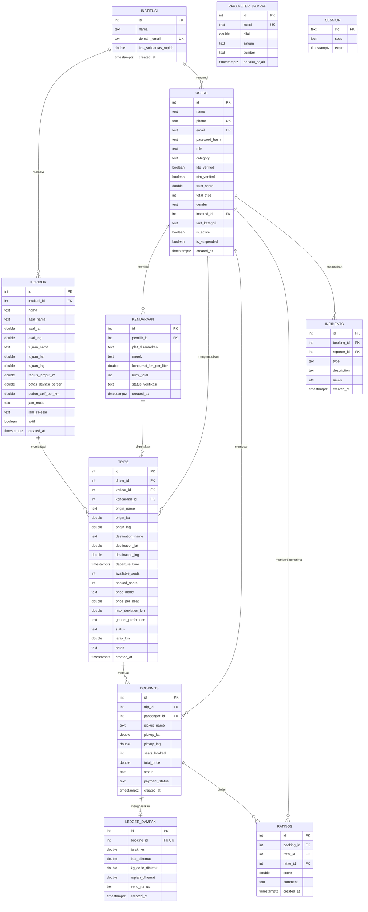

# Diagram Hubungan Entitas dan Model Data (ERD)

Dokumen ini menjelaskan struktur relasi basis data PostgreSQL untuk platform Searah, analisis normalisasi bentuk normal ketiga (3NF), serta prinsip integritas temporal pada pencatatan ledger dampak.

## 1. Diagram Relasi Entitas (Mermaid erDiagram)

## 2. Analisis Bentuk Normal Ketiga (3NF)

Skema basis data memenuhi kaidah bentuk normal ketiga:

1. Bentuk Normal Pertama (1NF): Setiap kolom hanya menyimpan nilai skalar atomik tunggal. Tidak ada atribut bernilai ganda atau kelompok data berulang di dalam satu kolom.
2. Bentuk Normal Kedua (2NF): Seluruh tabel menggunakan kunci primer tunggal (id tipe integer serial atau sid tipe text). Setiap atribut non-kunci bergantung sepenuhnya pada kunci primer tabel tersebut.
3. Bentuk Normal Ketiga (3NF): Tidak ada ketergantungan transitif antarkolom non-kunci. Data institusi dipisahkan dari pengguna, data kendaraan dipisahkan dari perjalanan, dan data koridor dipisahkan dari institusi.

## 3. Desain Integritas Temporal pada Ledger Dampak

Tabel `ledger_dampak` mematuhi prinsip integritas temporal untuk kebutuhan audit lingkungan:

1. Nilai Tersimpan Permanen (Immutability): Setiap entri dihitung tepat satu kali saat perjalanan mencapai status selesai. Baris tidak pernah diperbarui atau dihitung ulang saat antarmuka merender grafik.
2. Isolasi dari Perubahan Parameter: Tabel `parameter_dampak` dapat diperbarui di masa mendatang jika harga bahan bakar acuan bersubsidi berubah atau koefisien emisi nasional direvisi. Pembaruan tersebut hanya berlaku untuk perjalanan yang diselesaikan setelah waktu pembaruan. Rekam jejak penghematan masa lalu tetap utuh mencerminkan kondisi riil saat perjalanan berlangsung.
3. Penelusuran Versi Rumus: Kolom `versi_rumus` menyimpan pengidentifikasi algoritma yang digunakan saat penghitungan, misalnya `dampak-1.0.0`. Hal ini memungkinkan verifikasi retroaktif dan pembandingan kinerja model antarperiode.
